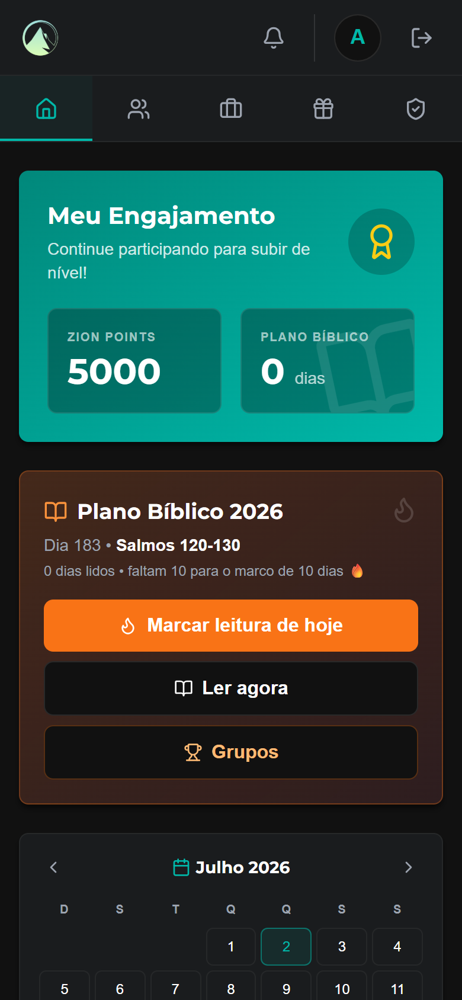
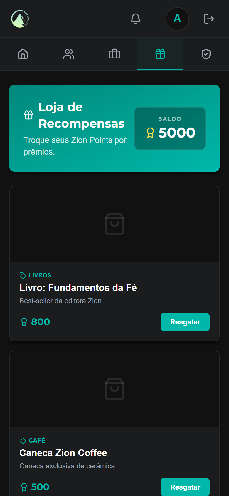
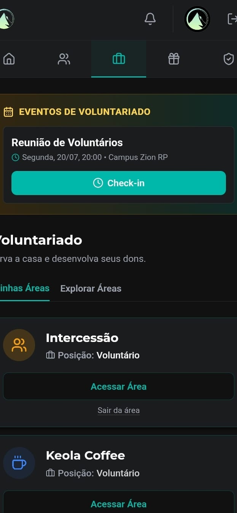
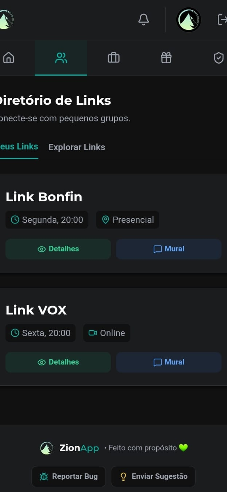
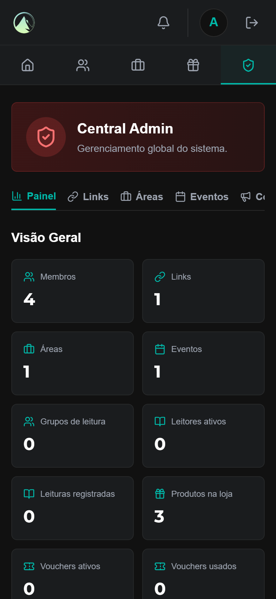

<div align="center">


# 🏔️ ZionApp

### O app que transforma a vida da comunidade em engajamento, serviço e propósito.

*Plano bíblico gamificado • Pequenos grupos • Voluntariado • Loja de recompensas • Intercessão*

<br/>


</div>

<div align="center">

</div>

---

## ✨ Sobre o projeto

O **ZionApp** é um aplicativo web (responsivo, pronto para o celular) que centraliza tudo o que uma **comunidade eclesiástica** precisa em um só lugar — e usa **gamificação** para transformar participação em hábito.

Em vez de espalhar tudo em grupos de mensagens e planilhas, o app organiza **leitura bíblica, eventos, pequenos grupos, escalas de voluntários, pedidos de oração e recompensas** — com pontos, marcos e rankings que incentivam o envolvimento diário.

> 💡 **Intuito:** aplicar tecnologia a serviço do próximo — colocar a fé em prática (Tiago 2:26), fortalecendo o engajamento da igreja e dando à liderança ferramentas reais de gestão e comunicação.

Este é um projeto de **Atividade de Extensão** do curso de Análise e Desenvolvimento de Sistemas, em parceria com a Igreja Zion (Ribeirão Preto).

---

## 🚀 Funcionalidades

| | Módulo | O que faz |
|---|---|---|
| 📖 | **Plano Bíblico** | Leitura diária, com texto no próprio app, sequência (streak), marcos, efeito de "fogo" e planos editáveis por ano (+ atalho para o Spotify). |
| 🔥 | **Gamificação** | Ganhe **Zion Points** ao ler, servir e participar. Regras configuráveis e ranking. |
| 👥 | **Links (pequenos grupos)** | Explore, entre (com aprovação do líder ou convite direto) e interaja no mural: reações, enquetes e avisos fixados. |
| 🤝 | **Voluntariado** | Áreas de serviço, escalas, disponibilidade, **treinamentos por módulo** (com pré-requisito para servir numa posição) e mural da equipe. |
| 🎁 | **Loja de Recompensas** | Troque pontos por prêmios. O voucher é validado pelo atendente via **QR Code** (leitor de câmera embutido). |
| 🙏 | **Intercessão** | Envie pedidos de oração; acesso à lista controlado por área, cargo ou liberação individual. |
| 📅 | **Eventos + Check-in por QR** | RSVP e depois check-in real (por código ou câmera) — presença confirmada credita pontos. |
| 🏆 | **Grupos de leitura** | Competição saudável estilo "gym rats": chat, convites, ranking por grupo e ranking geral. |
| 🔔 | **Notificações inteligentes** | Avisos que levam direto à tela certa, com lembrete diário de leitura. |
| 🛠️ | **Painel Admin** | Métricas, gestão de conteúdo, cargos, matriz de permissões, loja, gamificação, planos de leitura e reportes de bugs. |

---

## 📸 Telas

<div align="center">

&nbsp;
&nbsp;


&nbsp;


<sub>Início · Loja · Voluntários · Links · Admin</sub>

</div>

---

## 🎮 Como funciona a gamificação

Cada ação vira **Zion Points** (creditados de forma segura, sem duplicação):

- 🎉 **+100** ao criar a conta (boas-vindas)
- 📖 **+15** leitura do dia com foto · **+5** sem foto
- 🔥 **+50 a +300** ao bater marcos de sequência (10, 20, 30, 45, 60 dias)
- 📅 **+20** check-in em evento · 🤝 **+50** confirmar escala · 🎓 **+150** concluir treinamento

Os pontos são trocados por prêmios na **Loja**.

---

## 👑 Cargos

```
Membro → Voluntário → Auxiliar de Líder → Líder → Pastor → Admin
```

Cada nível desbloqueia responsabilidades (aprovar entradas, criar escalas, moderar murais…). **Pastor** tem quase todos os acessos de admin; **Admin** controla o sistema e a matriz de permissões por cargo.

---

## 🧱 Stack

**Frontend:** React 19 · Vite · TailwindCSS · lucide-react
**Backend:** Node.js · Express 5 · TypeScript · Prisma ORM · PostgreSQL
**Deploy:** Vercel (frontend) · Render (backend) · Neon (banco PostgreSQL)
**Segurança:** JWT · bcrypt · Zod · rate limiting · autorização por cargo/permissão

---

## ⚡ Como rodar

```bash
# Backend (porta 3000) — precisa de um DATABASE_URL (Postgres) em backend/.env
cd backend
npm install
npx prisma db push --skip-generate && npx prisma generate
npx tsx src/server.ts
# 1ª vez: popular dados de exemplo
curl -X POST http://localhost:3000/api/seed -H "x-seed-key: zion-dev-seed"

# Frontend (porta 5173)
cd frontend
npm install
npm run dev
```

Acesse **http://localhost:5173** — ou pelo **IP da máquina** (`http://192.168.x.x:5173`) para testar no celular na mesma Wi-Fi.

**Login de exemplo:** `admin@zion.com` / `123`

---

## 📱 Vira app de celular?

Sim! O app já é responsivo. Próximos passos possíveis:
- **PWA** — instalável direto pelo navegador (ícone na tela inicial).
- **Capacitor** — empacota o mesmo código em app **Android/iOS** para as lojas.

---

## 📚 Documentação

A documentação técnica completa (arquitetura, modelo de dados, **referência de toda a API**, cargos, gamificação e deploy) está em:

➡️ **[DOCUMENTACAO.md](DOCUMENTACAO.md)** · versão Word: **[DOCUMENTACAO.docx](DOCUMENTACAO.docx)**

---

<div align="center">

Feito com propósito 💚 — *"Tudo o que fizerem, façam de todo o coração, como para o Senhor."* (Colossenses 3:23)

</div>
